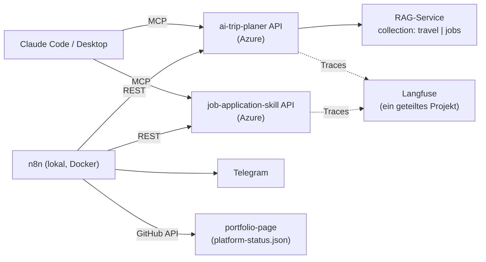

# life-ops-platform

Kein eigenständiges Produkt, sondern das Dach über zwei bestehenden Projekten:
[ai-trip-planer](https://github.com/hgrosche95/ai-trip-planer) und
[job-application-skill](https://github.com/hgrosche95/job-application-skill).
Die Frage dahinter: Was, wenn mehrere eigene LLM-Dienste nicht isoliert
nebeneinanderstehen, sondern sich Infrastruktur teilen und sich gegenseitig
automatisiert am Laufen halten?

Dieses Repo enthält selbst kaum Code, sondern die Verbindungen: eine
`docker-compose.yml` für n8n und vier n8n-Workflows, die die Dienste der
beiden Projekte über REST ansprechen.

## Architektur



**Zwei Zugänge zu denselben Fähigkeiten:** Claude spricht die Dienste über MCP
an, weil das Modell die Tools dort live selbst entdeckt. n8n nutzt einfaches
REST, weil die Abläufe vorab feststehen und MCP dort nur Overhead wäre.

## Was läuft wo

| Teil | Wo | Anmerkung |
|---|---|---|
| ai-trip-planer (API, RAG, Web) | Azure Container Apps + Static Web Apps | eigenes Repo, eigenes Deployment |
| job-application-skill (API) | Azure Container Apps | eigenes Repo, eigenes Deployment |
| Datenbank | Neon (Postgres + pgvector) | vom ai-trip-planer genutzt |
| Langfuse | Langfuse Cloud | ein Projekt für beide Dienste |
| **n8n** | **lokal**, `docker compose` auf meinem Rechner | läuft nur, wenn der Rechner an ist |

## Die Workflows

Details, Importbefehle und Einrichtung: [n8n/workflows/README.md](n8n/workflows/README.md).

| Workflow | Was er tut |
|---|---|
| `jobboerse-match-telegram` | RSS-Feed mit Stellenanzeigen beobachten, per `match_job_posting` gegen den Lebenslauf abgleichen, bei Treffer Telegram-Nachricht |
| `knowledge-ingest-watch` | stündlich die RAG-Ingestion anstoßen; unveränderte Dokumente überspringt sie per Hash |
| `langfuse-usage-warning` | Langfuse-Nutzung abfragen, bei Nähe zum Free-Tier-Limit per Telegram warnen |
| `publish-platform-status` | letzten Stand der drei anderen Workflows einsammeln und als `platform-status.json` in die Portfolio-Seite committen |

## Ehrlicher Stand

- **n8n läuft lokal.** Das Status-Widget auf der Portfolio-Seite ist deshalb
  nur so aktuell wie der letzte Lauf auf meinem Rechner. Der Umzug von n8n in
  die Cloud ist der nächste Schritt.
- **Die `jobs`-Collection im RAG-Service ist vorbereitet, aber leer.** Der
  Bewerbungshelfer fragt sie noch nicht ab. Befüllt und genutzt wird bisher nur
  `travel`.

## Lokal starten

```bash
docker compose up -d
```

Startet n8n auf `http://localhost:5678` und zusätzlich einen lokalen Container
der ai-trip-planer-API (Image aus GHCR, siehe Kommentar in
`docker-compose.yml`). Danach die Workflows und Credentials wie in
[n8n/workflows/README.md](n8n/workflows/README.md) beschrieben importieren.
Credentials nie im Repo-Ordner ablegen; die Anleitung dort schreibt sie über
`mktemp` in einen temporären Ordner und löscht sie danach wieder.

## Entstehung

Der ursprüngliche Bauplan mit den Projektphasen liegt unter
[docs/PLAN.md](docs/PLAN.md). Er beschreibt den Plan, nicht den Ist-Zustand.
